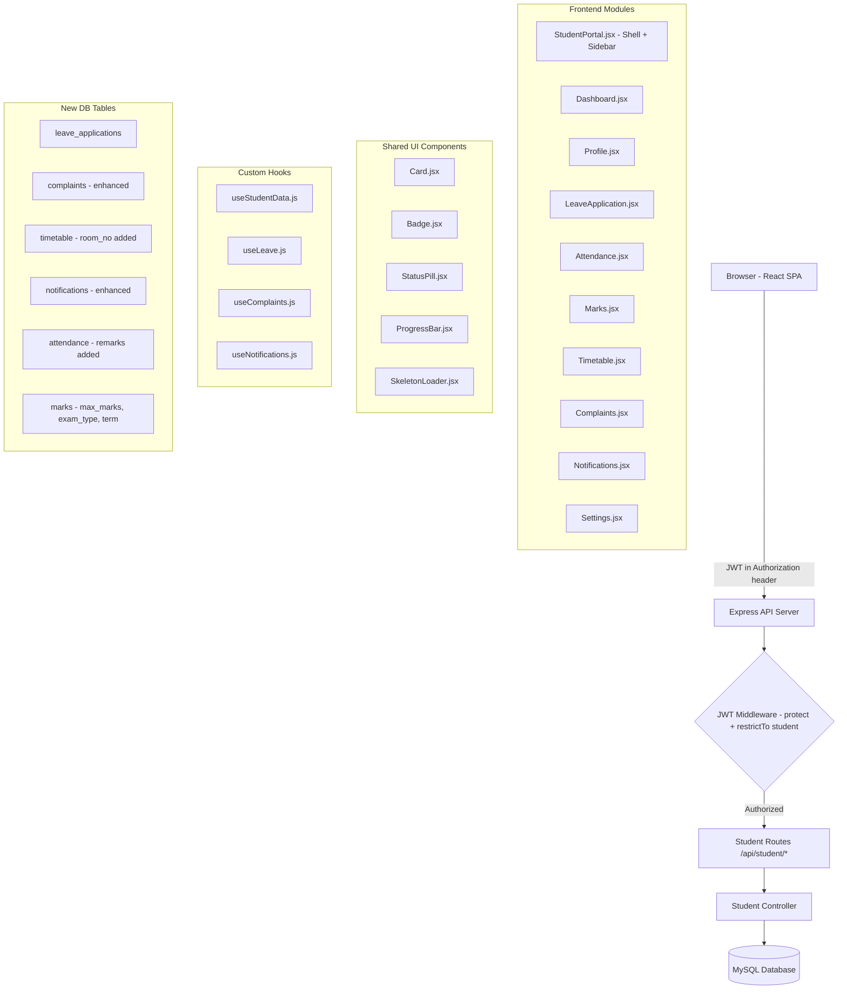
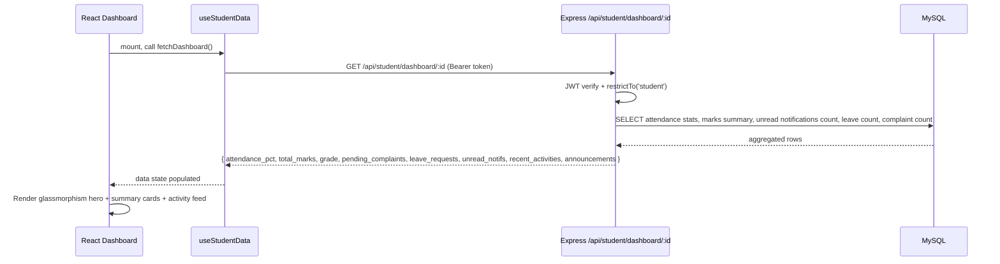
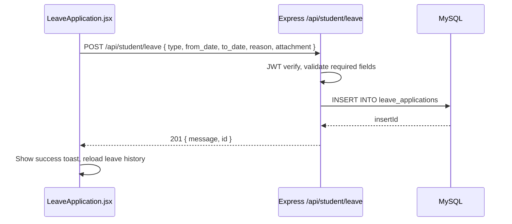
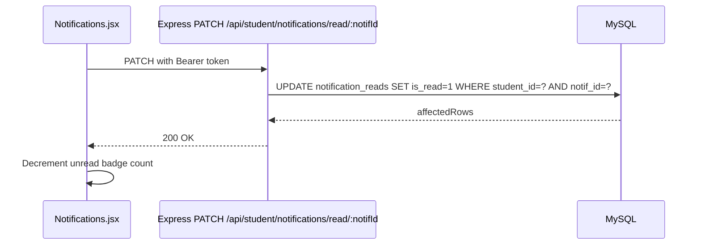

# Design Document: Student Portal Enhancement

## Overview

The Student Portal Enhancement extends the existing Smart School Management System by completing and professionalizing the student-facing module. The existing `StudentPortal.jsx` is a basic single-file implementation; this enhancement replaces it with a fully modular, feature-rich portal covering dashboard, profile, leave applications, attendance, marks, timetable, complaints, and notifications — all backed by new MySQL tables and REST API endpoints secured with JWT middleware.

The system is built on the existing stack: React + Vite + Tailwind CSS + Lucide React icons on the frontend, and Node.js + Express.js + MySQL on the backend, with JWT role-based authentication already in place. No existing routes, components, or database tables are removed.

## Architecture



## Sequence Diagrams

### Dashboard Load Flow



### Leave Application Submission Flow



### Mark as Read Notification Flow



## Components and Interfaces

### Component: StudentPortal (Shell)

**Purpose**: Top-level layout shell — sidebar navigation, header bar, dark-mode toggle, and outlet for page components.

**Interface**:
```jsx
// frontend/src/pages/student/StudentPortal.jsx
const StudentPortal = () => {
  // state: activeTab, sidebarOpen, darkMode, unreadCount
  // renders: <Sidebar />, <Header />, <main>{activeTabComponent}</main>
}
```

**Responsibilities**:
- Mount sidebar with all 9 navigation links + Logout
- Track `activeTab` state and render correct page component
- Provide `showToast(message, type)` callback to child pages
- Display unread notification badge count fetched on mount
- Toggle dark mode (class on `<html>`)

### Component: Dashboard

**Purpose**: Landing page showing the student's at-a-glance information.

**Interface**:
```jsx
// frontend/src/pages/student/Dashboard.jsx
const Dashboard = ({ showToast }) => {
  // uses: useStudentData('dashboard')
  // renders: WelcomeBanner, SummaryCards[6], RecentActivities, Announcements, QuickActions
}
```

**Responsibilities**:
- Render glassmorphism hero section with photo, name, register number, class, section, date
- Show 6 summary cards: Attendance %, Total Marks, Current Grade, Pending Complaints, Leave Requests, Unread Notifications
- Render last 5 recent activities feed
- Show latest announcements panel
- Quick Action buttons: Apply Leave, File Complaint, View Timetable, View Marks (each changes `activeTab` via prop callback)

### Component: LeaveApplication

**Purpose**: Submit leave requests and view leave history.

**Interface**:
```jsx
// frontend/src/pages/student/LeaveApplication.jsx
const LeaveApplication = ({ showToast }) => {
  // uses: useLeave()
  // state: form { type, from_date, to_date, reason, attachment }
  // renders: LeaveForm, LeaveHistoryTable
}
```

**Leave type options**: `['Sick', 'Casual', 'Emergency', 'Medical', 'Family Function', 'Other']`

**Responsibilities**:
- Render form with all required fields including optional file attachment
- Validate date range (from_date <= to_date)
- Submit via POST /api/student/leave
- Display leave history table with status pills (Pending/Approved/Rejected)

### Component: Attendance

**Purpose**: Read-only attendance view with stats and history.

**Interface**:
```jsx
// frontend/src/pages/student/Attendance.jsx
const Attendance = ({ showToast }) => {
  // uses: useStudentData('attendance')
  // renders: SummaryCard, MonthlyBarChart, StatsGrid, AttendanceHistoryTable
}
```

**Responsibilities**:
- Display attendance % summary card
- Monthly bar chart grouping Present/Absent/Late/Leave per month
- Stats row: Present Days, Absent Days, Late Days, Leave Days
- Color-coded history table: green=Present, red=Absent, yellow=Late, blue=Leave
- Show remarks column when available

### Component: Marks

**Purpose**: Read-only marks view with grade calculation and performance charts.

**Interface**:
```jsx
// frontend/src/pages/student/Marks.jsx
const Marks = ({ showToast }) => {
  // uses: useStudentData('marks')
  // renders: SubjectCards[], CircularChart, PerformanceSummary
}
```

**Grade rules implemented in frontend and backend**:
- A+ ≥ 95, A ≥ 90, B+ ≥ 80, B ≥ 70, C ≥ 60, D ≥ 50, F < 50

**Responsibilities**:
- Render subject cards (Tamil, English, Maths, Science, Social Science, Computer) with marks, max marks, progress bar
- Auto-calculate total, percentage, grade
- Circular chart for overall performance
- Identify Top Subject and Weak Subject from marks data

### Component: Timetable

**Purpose**: Read-only class timetable grid.

**Interface**:
```jsx
// frontend/src/pages/student/Timetable.jsx
const Timetable = ({ showToast }) => {
  // uses: useStudentData('timetable')
  // renders: TimetableGrid (periods as rows, Mon-Sat as columns)
}
```

**Responsibilities**:
- Grid layout: rows = periods (P1–P8 + Short Break + Lunch Break), columns = Mon–Sat
- Each cell: subject name, teacher name, room number
- Color-coded subject boxes using consistent subject color map
- Fully responsive (horizontal scroll on mobile)

### Component: Complaints

**Purpose**: File new complaints and view complaint history.

**Interface**:
```jsx
// frontend/src/pages/student/Complaints.jsx
const Complaints = ({ showToast }) => {
  // uses: useComplaints()
  // state: form { category, title, description, priority, anonymous, attachment }
  // renders: CategoryCards[], ComplaintForm, ComplaintHistoryTable
}
```

**Category options**: `['Academic', 'Teacher Behaviour', 'Bullying', 'Classroom', 'Transport', 'Fee', 'Exam', 'Library', 'Lab', 'Infrastructure', 'Hostel', 'Sports', 'Other']`

**Responsibilities**:
- Category selection card grid at top (click to select, highlighted)
- Form fields: category, title, description, priority (Low/Medium/High), identity toggle (Show/Anonymous), attachment
- History table: ID | Category | Date | Status | Admin Reply

### Component: Notifications

**Purpose**: Tabbed view of all notification types with mark-as-read.

**Interface**:
```jsx
// frontend/src/pages/student/Notifications.jsx
const Notifications = ({ showToast }) => {
  // uses: useNotifications()
  // state: activeNotifTab ('announcements'|'holidays'|'exam_notices'|'circulars'|'principal_messages')
  // renders: TabBar, NotificationList, UnreadBadge
}
```

**Responsibilities**:
- Tabs: Announcements | Holidays | Exam Notices | Circulars | Principal Messages
- Mark individual notification as read via PATCH /api/student/notifications/read/:notifId
- Unread count badge on sidebar Notifications icon

### Shared UI Components

```jsx
// frontend/src/components/student/Card.jsx
const Card = ({ title, value, icon, color, trend }) => { /* shadow, rounded, gradient */ }

// frontend/src/components/student/Badge.jsx  
const Badge = ({ label, color }) => { /* pill-shaped status badge */ }

// frontend/src/components/student/StatusPill.jsx
const StatusPill = ({ status }) => { /* maps status string to color */ }

// frontend/src/components/student/ProgressBar.jsx
const ProgressBar = ({ value, max, color }) => { /* animated width bar */ }

// frontend/src/components/student/SkeletonLoader.jsx
const SkeletonLoader = ({ type }) => { /* shimmer placeholders: 'card'|'table'|'list' */ }
```

## Data Models

### New / Enhanced MySQL Tables

#### leave_applications
```sql
CREATE TABLE IF NOT EXISTS leave_applications (
  id           INT AUTO_INCREMENT PRIMARY KEY,
  student_id   INT NOT NULL,
  type         ENUM('Sick','Casual','Emergency','Medical','Family Function','Other') NOT NULL,
  from_date    DATE NOT NULL,
  to_date      DATE NOT NULL,
  reason       TEXT NOT NULL,
  attachment   VARCHAR(255) NULL,
  status       ENUM('Pending','Approved','Rejected') DEFAULT 'Pending',
  created_at   TIMESTAMP DEFAULT CURRENT_TIMESTAMP,
  FOREIGN KEY (student_id) REFERENCES students(id) ON DELETE CASCADE
);
```

**Validation Rules**:
- `from_date` must be <= `to_date`
- `reason` must be non-empty
- `type` must match one of the ENUM values

#### complaints (enhanced from existing)
```sql
-- Add columns to existing complaints table
ALTER TABLE complaints
  ADD COLUMN category VARCHAR(50) NOT NULL DEFAULT 'Other',
  ADD COLUMN priority ENUM('Low','Medium','High') DEFAULT 'Medium',
  ADD COLUMN attachment VARCHAR(255) NULL,
  ADD COLUMN admin_reply TEXT NULL;
-- Note: existing 'reply' column renamed to admin_reply in new inserts
```

**Validation Rules**:
- `title` max 150 chars
- `category` must be a known category string
- `priority` defaults to 'Medium'

#### timetable (enhanced)
```sql
-- Add room_no to existing timetable table
ALTER TABLE timetable
  ADD COLUMN room_no VARCHAR(20) NULL;
```

#### notifications (enhanced — add per-student read tracking)
```sql
-- New table for tracking per-student read status
CREATE TABLE IF NOT EXISTS notification_reads (
  id          INT AUTO_INCREMENT PRIMARY KEY,
  notif_id    INT NOT NULL,
  student_id  INT NOT NULL,
  is_read     TINYINT(1) DEFAULT 0,
  read_at     TIMESTAMP NULL,
  UNIQUE KEY unique_read (notif_id, student_id),
  FOREIGN KEY (notif_id)   REFERENCES notifications(id) ON DELETE CASCADE,
  FOREIGN KEY (student_id) REFERENCES students(id) ON DELETE CASCADE
);

-- Add type column to notifications for tab filtering
ALTER TABLE notifications
  ADD COLUMN type ENUM('announcement','holiday','exam_notice','circular','principal_message') DEFAULT 'announcement';
```

#### attendance (enhanced)
```sql
-- Add remarks column to existing attendance table
ALTER TABLE attendance
  ADD COLUMN remarks VARCHAR(255) NULL;
```

#### marks (enhanced)
```sql
-- Add max_marks, exam_type, term to existing marks table
ALTER TABLE marks
  ADD COLUMN max_marks  INT DEFAULT 100,
  ADD COLUMN exam_type  VARCHAR(50) DEFAULT 'Internal',
  ADD COLUMN term       VARCHAR(20) DEFAULT 'Term 1';
```

### API Request/Response Shapes

```javascript
// GET /api/student/dashboard/:id
// Response:
{
  student: { name, register_number, photo_url, class_name, section_name },
  summary: {
    attendance_pct: "87.5",
    total_marks: 450,
    max_possible: 500,
    grade: "A",
    pending_complaints: 1,
    leave_requests: 2,
    unread_notifications: 3
  },
  recent_activities: [{ type, description, created_at }],  // last 5
  announcements: [{ id, title, message, created_at }]       // latest 3
}

// POST /api/student/leave
// Request body:
{ type, from_date, to_date, reason, attachment? }
// Response:
{ message: "Leave application submitted successfully", id: 7 }

// GET /api/student/leave/:studentId
// Response:
{ leaves: [{ id, type, from_date, to_date, reason, status, created_at }] }

// POST /api/student/complaint
// Request body:
{ category, title, description, priority, anonymous, attachment? }
// Response:
{ message: "Complaint submitted successfully", id: 12 }

// GET /api/student/complaint/:studentId
// Response:
{ complaints: [{ id, category, title, description, priority, status, admin_reply, created_at }] }

// GET /api/student/notifications/:studentId
// Response:
{ notifications: [{ id, type, title, message, is_read, created_at }] }

// PATCH /api/student/notifications/read/:notifId
// Response:
{ message: "Marked as read" }

// GET /api/student/attendance/:studentId
// Response:
{
  attendance: [{ id, date, status, remarks }],
  stats: { total, present, absent, late, leave, percentage },
  monthly: [{ month: "2024-01", present: 18, absent: 2, late: 1, leave: 0 }]
}

// GET /api/student/marks/:studentId
// Response:
{
  marks: [{ subject, marks_obtained, max_marks, exam_type, term, grade }],
  summary: { total, max_possible, percentage, grade, top_subject, weak_subject }
}

// GET /api/student/timetable/:classId/:sectionId
// Response:
{ timetable: [{ day_of_week, period_number, subject_name, teacher_name, room_no }] }
```

## Algorithmic Pseudocode

### Main Student Portal Route Dispatch

```pascal
ALGORITHM renderStudentPortal(activeTab)
INPUT: activeTab: string
OUTPUT: React component tree

BEGIN
  SEQUENCE
    token ← localStorage.getItem('token')
    IF token IS NULL THEN
      REDIRECT to '/login'
    END IF

    CASE activeTab OF
      'dashboard'      → RENDER <Dashboard />
      'profile'        → RENDER <Profile />
      'attendance'     → RENDER <Attendance />
      'marks'          → RENDER <Marks />
      'timetable'      → RENDER <Timetable />
      'leave'          → RENDER <LeaveApplication />
      'complaints'     → RENDER <Complaints />
      'notifications'  → RENDER <Notifications />
      'settings'       → RENDER <Settings />
      DEFAULT          → RENDER <Dashboard />
    END CASE
  END SEQUENCE
END
```

### Grade Calculation Algorithm

```pascal
ALGORITHM calculateGrade(percentage)
INPUT: percentage: number (0..100)
OUTPUT: grade: string

BEGIN
  IF percentage >= 95 THEN RETURN 'A+'
  ELSE IF percentage >= 90 THEN RETURN 'A'
  ELSE IF percentage >= 80 THEN RETURN 'B+'
  ELSE IF percentage >= 70 THEN RETURN 'B'
  ELSE IF percentage >= 60 THEN RETURN 'C'
  ELSE IF percentage >= 50 THEN RETURN 'D'
  ELSE RETURN 'F'
  END IF
END
```

**Preconditions**: `percentage` is a number in range [0, 100]
**Postconditions**: Returns exactly one grade string from {'A+','A','B+','B','C','D','F'}

### Attendance Percentage Calculation

```pascal
ALGORITHM calculateAttendancePct(records)
INPUT: records: Array<{ status: 'Present'|'Absent'|'Late'|'Leave' }>
OUTPUT: pct: string (e.g. "87.5")

BEGIN
  total ← records.length
  IF total = 0 THEN RETURN "100.0" END IF

  present ← COUNT records WHERE status = 'Present'
  late    ← COUNT records WHERE status = 'Late'
  leave   ← COUNT records WHERE status = 'Leave'

  -- Present + Late + Leave all count toward attendance
  effective ← present + late + leave
  pct ← (effective / total * 100).toFixed(1)
  RETURN pct
END
```

**Preconditions**: `records` is a non-null array
**Postconditions**: Returns string representation of percentage, "100.0" when no records

**Loop Invariants**: All records processed; running sum only includes Present/Late/Leave statuses

### Monthly Attendance Grouping

```pascal
ALGORITHM groupAttendanceByMonth(records)
INPUT: records: Array<{ date: string, status: string }>
OUTPUT: monthly: Array<{ month: string, present, absent, late, leave }>

BEGIN
  monthMap ← empty Map

  FOR each record IN records DO
    month ← record.date.substring(0, 7)  -- 'YYYY-MM'
    IF monthMap[month] IS NULL THEN
      monthMap[month] ← { month, present:0, absent:0, late:0, leave:0 }
    END IF
    CASE record.status OF
      'Present' → monthMap[month].present++
      'Absent'  → monthMap[month].absent++
      'Late'    → monthMap[month].late++
      'Leave'   → monthMap[month].leave++
    END CASE
  END FOR

  RETURN SORT monthMap.values() BY month ASC
END
```

**Loop Invariants**: All previously processed months remain in `monthMap` with correct cumulative counts

### Leave Application Validation

```pascal
ALGORITHM validateLeaveForm(form)
INPUT: form: { type, from_date, to_date, reason }
OUTPUT: { valid: boolean, errors: string[] }

BEGIN
  errors ← []

  IF form.type NOT IN ['Sick','Casual','Emergency','Medical','Family Function','Other'] THEN
    errors.push('Invalid leave type')
  END IF

  IF form.from_date IS NULL OR form.to_date IS NULL THEN
    errors.push('Both dates are required')
  ELSE IF parseDate(form.from_date) > parseDate(form.to_date) THEN
    errors.push('From date must be before or equal to To date')
  END IF

  IF form.reason.trim().length = 0 THEN
    errors.push('Reason is required')
  END IF

  RETURN { valid: errors.length = 0, errors }
END
```

**Preconditions**: `form` is non-null
**Postconditions**: Returns valid=true only when all validation rules pass with empty errors array

### Top/Weak Subject Detection

```pascal
ALGORITHM findTopAndWeakSubject(marks)
INPUT: marks: Array<{ subject: string, marks_obtained: number, max_marks: number }>
OUTPUT: { top_subject: string, weak_subject: string }

BEGIN
  IF marks.length = 0 THEN RETURN { top_subject: 'N/A', weak_subject: 'N/A' } END IF

  -- Normalize to percentage for fair comparison
  normalized ← marks.map(m → { subject: m.subject, pct: m.marks_obtained / m.max_marks * 100 })

  top  ← normalized entry with maximum pct
  weak ← normalized entry with minimum pct

  RETURN { top_subject: top.subject, weak_subject: weak.subject }
END
```

### Notification Unread Count

```pascal
ALGORITHM getUnreadCount(studentId, db)
INPUT: studentId: number
OUTPUT: count: number

BEGIN
  allNotifs ← SELECT id FROM notifications
               WHERE role IN ('all', 'student')

  readNotifIds ← SELECT notif_id FROM notification_reads
                 WHERE student_id = studentId AND is_read = 1

  unread ← allNotifs.filter(n → n.id NOT IN readNotifIds)
  RETURN unread.length
END
```

## Key Functions with Formal Specifications

### Backend: `getDashboard(req, res)`

```javascript
// GET /api/student/dashboard/:id
async function getDashboard(req, res)
```

**Preconditions**:
- `req.user.role === 'student'`
- `req.user.refId` is a valid student ID in the `students` table
- JWT token is present and valid

**Postconditions**:
- Returns 200 with complete dashboard object including all summary stats
- Returns 404 if student not found
- Returns 403 if user is not a student
- All numeric fields (attendance_pct, total_marks, etc.) are non-null numbers or computed defaults

### Backend: `submitLeave(req, res)`

```javascript
// POST /api/student/leave
async function submitLeave(req, res)
```

**Preconditions**:
- `req.body.type` is a valid leave type enum value
- `req.body.from_date <= req.body.to_date` as dates
- `req.body.reason` is non-empty string
- `req.user.refId` maps to a valid student

**Postconditions**:
- Inserts one row into `leave_applications` with status='Pending'
- Returns 201 with `{ message, id }` on success
- Returns 400 with validation errors if preconditions not met
- No changes made to DB on validation failure (transactional safety)

### Backend: `markNotificationRead(req, res)`

```javascript
// PATCH /api/student/notifications/read/:notifId
async function markNotificationRead(req, res)
```

**Preconditions**:
- `:notifId` is a positive integer
- `req.user.refId` is a valid student ID
- The notification exists in `notifications` table

**Postconditions**:
- Inserts or updates row in `notification_reads` with is_read=1
- Returns 200 on success
- Returns 404 if notification not found
- Idempotent: calling again on already-read notification still returns 200

### Frontend Hook: `useStudentData(endpoint)`

```javascript
// frontend/src/hooks/useStudentData.js
function useStudentData(endpoint) {
  // returns: { data, loading, error, refetch }
}
```

**Preconditions**:
- `endpoint` is one of: 'dashboard', 'profile', 'attendance', 'marks', 'timetable'
- JWT token exists in localStorage

**Postconditions**:
- `loading` is true during fetch, false after completion
- `data` is populated on success, null on error
- `error` is null on success, error message string on failure
- `refetch()` re-triggers the API call

### Frontend Hook: `useLeave()`

```javascript
// frontend/src/hooks/useLeave.js
function useLeave() {
  // returns: { leaves, loading, submitLeave, refetch }
}
```

**Preconditions**:
- Student is authenticated

**Postconditions**:
- `submitLeave(form)` validates locally before API call, returns Promise
- On success: `leaves` array updated with new entry
- On failure: throws error with message for toast display

### Frontend: `calculateGrade(percentage)` (shared utility)

```javascript
// frontend/src/utils/gradeUtils.js
function calculateGrade(percentage: number): string
```

**Preconditions**: `percentage` is a finite number in [0, 100]
**Postconditions**: Returns grade string; result is deterministic for same input

**Loop Invariants**: N/A (chain of conditional comparisons, no loops)

## Example Usage

### Dashboard API call from hook

```javascript
// useStudentData.js
const useStudentData = (endpoint) => {
  const [data, setData] = useState(null);
  const [loading, setLoading] = useState(true);
  const [error, setError] = useState(null);

  const fetchData = useCallback(async () => {
    setLoading(true);
    try {
      const res = await api.get(`/student/${endpoint}`);
      setData(res.data);
    } catch (err) {
      setError(err.response?.data?.message || 'Failed to load data');
    } finally {
      setLoading(false);
    }
  }, [endpoint]);

  useEffect(() => { fetchData(); }, [fetchData]);
  return { data, loading, error, refetch: fetchData };
};
```

### Leave submission from component

```javascript
// LeaveApplication.jsx
const handleSubmit = async (e) => {
  e.preventDefault();
  const { valid, errors } = validateLeaveForm(form);
  if (!valid) { showToast(errors[0], 'error'); return; }

  try {
    await api.post('/student/leave', form);
    showToast('Leave application submitted successfully');
    setForm({ type: '', from_date: '', to_date: '', reason: '', attachment: null });
    refetchLeaves();
  } catch (err) {
    showToast(err.response?.data?.message || 'Submission failed', 'error');
  }
};
```

### Backend dashboard controller snippet

```javascript
// studentController.js - getDashboard
exports.getDashboard = async (req, res) => {
  const studentId = req.user.refId;

  const [[student]] = await pool.query(
    `SELECT s.name, s.register_number, s.photo_url, c.class_name, sec.section_name
     FROM students s
     LEFT JOIN classes c ON s.class_id = c.id
     LEFT JOIN sections sec ON s.section_id = sec.id
     WHERE s.id = ?`, [studentId]
  );

  const [[attStats]] = await pool.query(
    `SELECT COUNT(*) as total,
       SUM(status='Present') as present,
       SUM(status='Late') as late,
       SUM(status='Leave') as leave_days
     FROM attendance WHERE student_id = ?`, [studentId]
  );

  const pct = attStats.total > 0
    ? ((attStats.present + attStats.late + attStats.leave_days) / attStats.total * 100).toFixed(1)
    : '100.0';

  // ... aggregate marks, complaints, leave, notifications
  return res.status(200).json({ student, summary: { attendance_pct: pct, /* ... */ } });
};
```

### Marks subject card rendering

```jsx
// Marks.jsx
{marks.map(m => (
  <div key={m.subject} className="bg-white dark:bg-slate-900 rounded-2xl p-5 shadow-sm border border-slate-200 dark:border-slate-800">
    <div className="flex justify-between items-start mb-3">
      <h4 className="font-semibold text-slate-800 dark:text-white">{m.subject}</h4>
      <span className={`text-lg font-bold ${gradeColor[m.grade]}`}>{m.grade}</span>
    </div>
    <ProgressBar value={m.marks_obtained} max={m.max_marks} color="indigo" />
    <p className="text-sm text-slate-500 mt-2">
      {m.marks_obtained} / {m.max_marks} marks
    </p>
  </div>
))}
```

## Error Handling

### Error Scenario 1: Expired or Missing JWT Token

**Condition**: Student's JWT has expired or was removed from localStorage
**Response**: API returns 401; Axios interceptor in `api.js` catches the response, clears localStorage, and redirects to `/login`
**Recovery**: Student logs in again to get a fresh token

### Error Scenario 2: Student Has No Class/Section Assigned

**Condition**: `students.class_id` or `students.section_id` is NULL when timetable is requested
**Response**: API returns 400 `{ message: "Student is not assigned to a class or section yet." }`
**Recovery**: Frontend displays an informational empty state rather than an error toast; admin must assign the student

### Error Scenario 3: Invalid Leave Date Range

**Condition**: `from_date > to_date` in leave submission
**Response**: Frontend validation catches this before API call and shows toast error "From date must be before or equal to To date"
**Recovery**: User corrects the date fields and resubmits

### Error Scenario 4: Database Connection Failure

**Condition**: MySQL connection pool throws an error on any query
**Response**: Express error handler returns 500 `{ message: "Server error" }`; frontend shows error toast
**Recovery**: Connection pool auto-reconnects; student can retry after a few seconds

### Error Scenario 5: File Attachment Exceeds Size Limit

**Condition**: Attachment upload exceeds configured multer limit (5 MB default)
**Response**: API returns 400 `{ message: "File too large. Maximum size is 5MB." }`
**Recovery**: Frontend shows toast; user selects a smaller file

### Error Scenario 6: Student Tries to Access Another Student's Data

**Condition**: JWT `refId` does not match the `student_id` in the resource being requested (e.g., via crafted URL param)
**Response**: All student queries use `req.user.refId` server-side, ignoring any URL params for the student's own data; returns only own data
**Recovery**: N/A — security boundary is enforced at controller level

## Testing Strategy

### Unit Testing Approach

Test each pure utility function in isolation:
- `calculateGrade(percentage)` — test all grade boundaries (0, 49, 50, 59, 60, 69, 70, 79, 80, 89, 90, 94, 95, 100)
- `calculateAttendancePct(records)` — empty array, all present, mixed statuses
- `validateLeaveForm(form)` — valid form, missing type, invalid date range, empty reason
- `findTopAndWeakSubject(marks)` — empty array, single subject, all equal marks, distinct max/min

Test framework: Vitest (already available via Vite setup)

### Property-Based Testing Approach

**Property Test Library**: fast-check

Key properties to verify:
- For all `percentage` values in [0, 100]: `calculateGrade(percentage)` always returns a string in `{'A+','A','B+','B','C','D','F'}`
- For all non-empty attendance record arrays: `calculateAttendancePct` returns a string parseable to a float in [0, 100]
- For all valid leave forms: validation returns `valid: true`; for any form with `from_date > to_date`: returns `valid: false`
- Grade calculation is monotonically non-decreasing: if `a >= b` then `gradeRank(calculateGrade(a)) >= gradeRank(calculateGrade(b))`

### Integration Testing Approach

Test backend API endpoints using supertest:
- `GET /api/student/profile` — with valid student JWT, with missing token (401), with wrong role (403)
- `POST /api/student/leave` — valid body inserts correctly, invalid dates return 400, missing fields return 400
- `PATCH /api/student/notifications/read/:notifId` — marks as read, idempotent second call
- `GET /api/student/dashboard/:id` — returns all required fields, numeric stats are valid

## Performance Considerations

- Dashboard uses a single aggregated query rather than 6 separate queries to minimize round trips
- Monthly attendance grouping is done in JavaScript after fetching records (acceptable for ≤ 365 rows per student per year)
- Notifications: only unread count is fetched on sidebar mount; full list fetched only when Notifications tab is opened
- `SkeletonLoader` components shown immediately while data fetches to prevent layout shift
- React `useCallback` + `useEffect` dependency array used correctly in custom hooks to prevent infinite re-renders
- `notification_reads` table has a composite unique index on `(notif_id, student_id)` for O(1) upsert

## Security Considerations

- All `/api/student/*` routes are protected by `protect` (JWT verification) + `restrictTo('student')` middleware
- Student data access uses `req.user.refId` from the verified JWT — URL parameters are never trusted for identifying the student
- File attachments stored with randomized filenames; validated for MIME type (image/\*, application/pdf) and size (5 MB max)
- `is_anonymous` flag on complaints: when true, the student's name is not exposed in admin/teacher complaint views
- SQL queries use parameterized statements (`pool.query('...WHERE id = ?', [id])`) throughout — no string interpolation
- No sensitive fields (password_hash, JWT secret) are ever included in API responses

## Dependencies

### Existing (no new installs required)
- React 18, React Router DOM — frontend routing
- Tailwind CSS v4 — styling
- Lucide React — icons
- Axios — HTTP client
- Express.js — backend framework
- mysql2/promise — database queries
- jsonwebtoken — JWT verification
- bcryptjs — password hashing
- dotenv — environment variables

### New (to be installed)
- `multer` (backend) — handling file attachment uploads (`npm install multer` in `/backend`)
- `recharts` (frontend) — bar chart for monthly attendance and circular chart for marks performance (`npm install recharts` in `/frontend`)

### Dev / Testing
- `vitest` — already available via Vite
- `fast-check` — property-based testing (`npm install -D fast-check` in `/frontend`)
- `supertest` — backend integration tests (`npm install -D supertest` in `/backend`)
